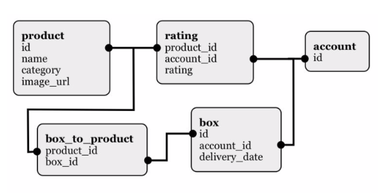

# graze full-stack test

## Background

At graze.com, customers sign up to receive weekly boxes, each containing 4 products. They don’t get to choose which products go in each box. Instead they rate the products online to tell us which ones they like and dislike. We select the products for their boxes based on these preferences.

## The task

Your task is to design a simple web interface that lets our customer service team:

- View the products sent to a given customer in each of their boxes.
- Change the customer’s rating for each product.

## The data

A MySQL database ([`data.sql`](db/data.sql)) is included, with 5 tables containing data from 200 customer accounts.

## Instructions

Requirements: [docker](https://www.docker.com/)

Start a local development server using the `make start-development` command. This will be accessible at <http://localhost>

If you wish to use composer to manage dependencies, you can use the `make composer-install` command. You can also interact directly with composer e.g. `docker-compose run composer install` or `docker-compose run composer require some/package`.

You can view logs using the `make logs` command.

Run `make stop-development` to bring down the running containers.

1. Build an interface with a single text input box that accepts an account ID. When an ID is entered, load the boxes sent to that account and display them along with the products in each box, and the date it was due for delivery.
1. Extend the above interface to display the rating (0 – 3) next to each product, and allow the user to adjust it.
1. Write a short paragraph outlining any assumptions you have made, any difficulties you encountered and further improvements you might make.
1. Email the project in a ZIP file, along with your paragraph, to the person who sent you the test. Alternatively please include a link to your code in a github repository.

## Notes

- Please build your solution in PHP, HTML, CSS and JavaScript.
- You may use any frameworks or code libraries that you like.
- You may assume that when a customer’s rating is missing for a given product that its rating is 1.

## What we’re looking for

- It’s important that you demonstrate your understanding of object oriented programming, MVC application structures and frontend development.
- You should only spend 3-4 hours on this task. Finishing is not as a important as demonstrating your capabilities.
